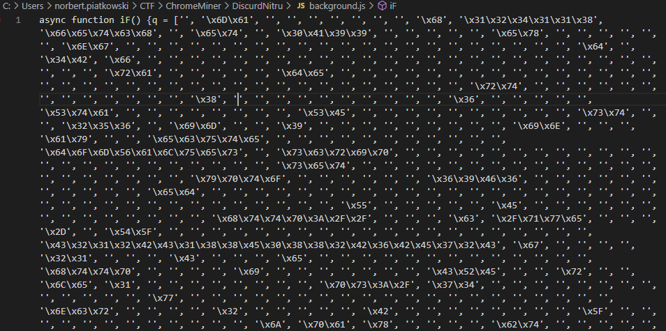
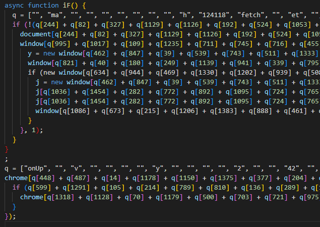
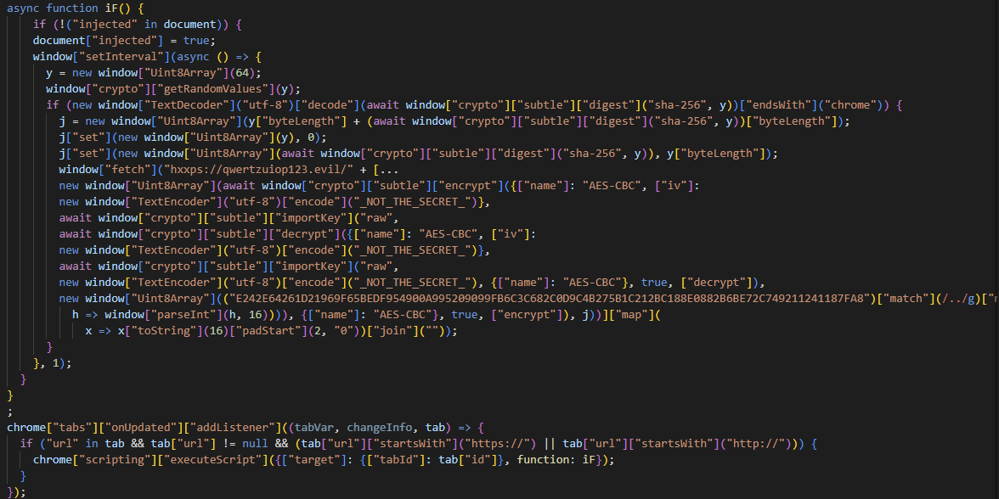

# ChromeMiner - (Reversing)

## Description

Discurd has filed a DMCA violation regarding a popular browser extension claiming to be conducting VIP giveaways on the company's product. The addon store has since taken down the extension to prevent any potential browser cryptomining malware from being distributed in the marketplace. Could you investigate what the 'Discurd Nitro Giveaway' addon does exactly?

There was one file attached, DiscurdNitru.crx

## Writeup

### Begin

Unpacking .crx with the online tool (https://crxextractor.com/) gives us `background.js` (and icons + manifest, but let's focus on the code)

### Deobfuscation

The code was obfuscated, but again, an online tool comes with help (https://deobfuscate.io/)

### Sanitization

After the deobfuscation, we still need to sanitize the file to get rid of the `q` array.

My first try was to manually sanitize the strings from the array `q` with python just copy pasting ``q[462] + q[847] + q[39] + q[539]...`` word after word, but there were plenty of them, so automated it...

Some C# code (Sanitizer.csx)...

Running: ``dotnet script .\Sanitizer.csx``

And we have sanitized strings from the array ``q``

JavaScript looks awful, I don't understand what's going on here, but we can see there is a code looking like encryption.

Also, there we can finally see some meaningful strings:
* `_NOT_THE_SECRET_`
* `E242E64261D21969F65BEDF954900A995209099FB6C3C682C0D9C4B275B1C212BC188E0882B6BE72C749211241187FA8`
* `AES-CBC`

### Decryption

So it looks like we have the encryption method `AES-CBC`, the encrypted message `E242E642...` and something that actually looks like the secret `_NOT_THE_SECRET`.

So another online tool comes with help (https://www.devglan.com/online-tools/aes-encryption-decryption):

* Encrypted message: `E242E64261D21969F65BEDF954900A995209099FB6C3C682C0D9C4B275B1C212BC188E0882B6BE72C749211241187FA8` (Hex)
* Cipher Mode: `CBC with key size 128 bits`
* Secret key: `_NOT_THE_SECRET_`

Gives Base64: `FxoNLwALJRwAJRc6DSojEV9DSFIwbWVfTTFOM1JfX30=`

Which gives: ` /%%:*#_CHR0me_M1N3R__}`

Well... half of the flag captured. But what about the first half? The secret key must be valid or else we wouldn't find anything.

But AES-CBC has something like `initialization vector`, so let's try using the same secret key as the `IV` as well

* IV: `_NOT_THE_SECRET_`

Gives Base64: `SFRCe19fbVlfdlJ5X293Tl9DSFIwbWVfTTFOM1JfX30=`

Which gives flag: `HTB{__mY_vRy_owN_CHR0me_M1N3R__}`